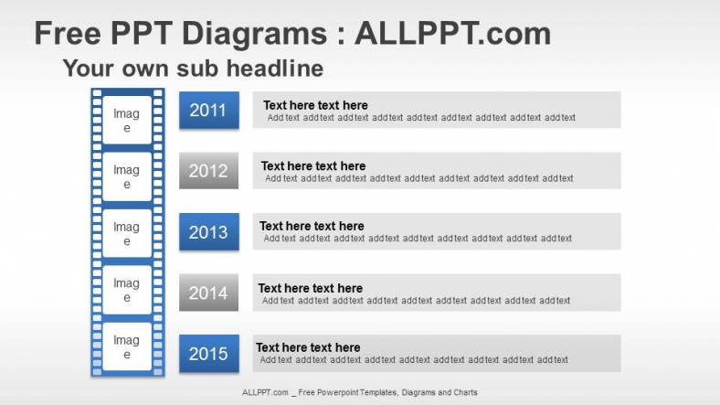
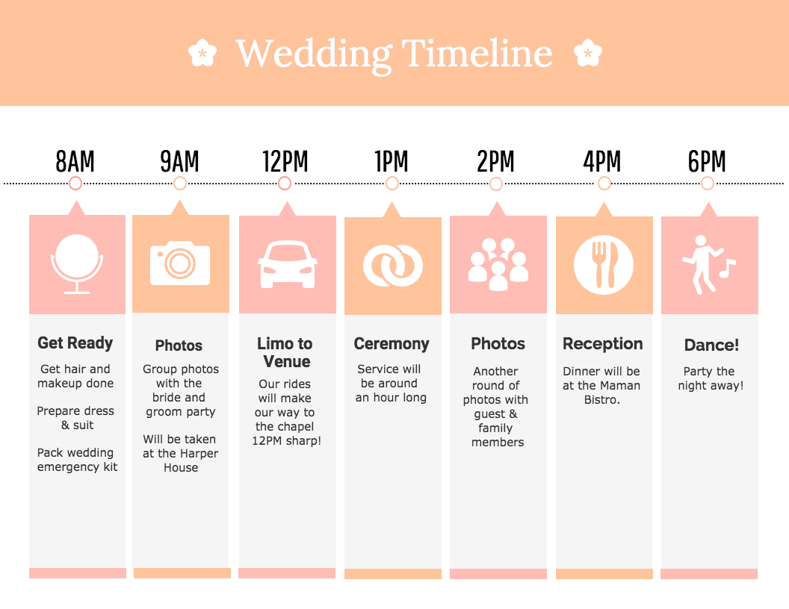

# The Darkest Timeline - A Tables Project

### Introduction

In this project, we'll create a [Darkest Timeline](https://en.wikipedia.org/wiki/Remedial_Chaos_Theory). Using tables!

Tables aren't something we'll be using a _ton_, because it's not 1998, but they're a simpler version of a lot of things we'll be doing a _lot of_, so they're a fantastic way to ramp up to that.

### Setup

This time, we won't be using an already-made HTML file, so limber up those html muscles!

* Create a REPL from scratch (not forked) with HTML/CSS/JavaScript as the language.
* Open the `index.html` file and give it the full html skeleton: `html`, `head`, and `body`.
* Put the content outlined below in the `body`!

### Content

You can choose either one of the following two methods for coming up with content for your timeline:

1. Choose a series of events in real life, your personal life or general history, that ended badly. For example, a bad breakup. Or the beginning of World War I.

2. Make up some events! Brownie Points for creativity. (Brownie points are not redeemable for actual brownies. Or anything at all.) Make sure it ends Sadly Ever After.

Either way, your timeline must have _at least_ five events.

### Presentation

Armed with your timeline, you'll make an `HTML` `<table>` that shows its events, in chronological order--in other words, a timeline. Each event should have:

* a title,
* a date and/or time,
* and a description of the event.

Please note that you do NOT have to use CSS to make this at all pretty.  You CAN, but do the full project BEFORE you make it beautiful.

**Now here's the tricky part: you're going to make TWO TABLES.**

They should have the EXACT SAME timeline, but one should present it vertically, and one should present it horizontally.

Here is an example of each type of timeline, although you do NOT have to follow the style or content whatsoever:

A vertical example: 

A horizontal example: 

Happy tabling!

### Stretch Goals

* Add a row/column with an image for each event. Store the image _locally_, preferably in a subdirectory of your project.
* Make a separate page for each table. Be sure to give the user a link from each page to the other, with clear link text so they know where they're going for the best user experience.
* Add table headings for each column or row (depending on the layout!). Look up the `<th>` tag!
* Change the content of your second table to add a "brightest" timeline version of the same events. Finally, a story that doesn't use tragedy as a narrative crutch!
* Have every image be the same width or height (whichever you think looks better). If you make them the same width _and_ height, you will likely change their aspect ratio and get some squishing or stretching, so pick one or the other!
* Make the image or title or text a link to another file. It could be an online resource about that event, or an extra content created locally about that event.
